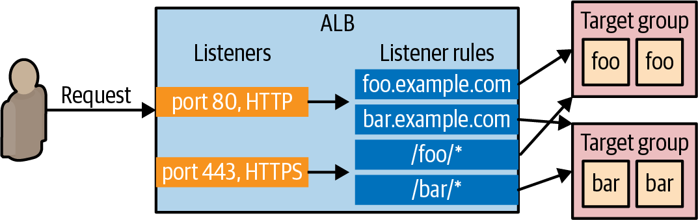

# Terraform - One Tool to Rule Them All

>Automate your Infrastructure with Terraform

1. What is Terraform
    - Infrastructure as a code tool that helps you declare the configuration for your server deployment on any cloud platform or your on-premise infrastructure.
    - Terraform creates and manages resources on cloud platforms and other services through their application programming interfaces (APIs). Providers enable Terraform to work with virtually any platform or service with an accessible API.
    - Terraform makes use of HCL (HashiCorp Configuration Language) which is easy to understand

2. Why you need it
    - Infrastructure deployment includes a lot of factors related to server environment, incoming and outgoing network, user authentication and authorizations strategy.
    - One of the most crucial parts of the infrastructure is to maintain the steady state of the user configuration, lifecycle of the server and stability of your application deployed on those servers.
    - Terraform is used to automate infrastructure provisioning using reusable, shareable, human-readable configuration files. The tool can automate infrastructure provisioning in both on-premises and cloud environments.

3. How to you use Terraform

    1. Provider
        - Terraform relies on plugins called providers to interact with cloud providers, SaaS providers, and other APIs.
        - Providers are Terraform plugins that are used to interact with remote systems such as Docker, AWS, Azure…
        - Terraform has a huge list of providers. A complete list of providers can be found here.

    2. How to Use Providers
        - Providers are released separately from Terraform itself and have their own version numbers.

Implementing VMs and Containers can be a tedious task when you need to manage them on larger scale. Terraform is the best tool to automate the provisioning and deployment of such resources in an instant. It provides plan to deploy or destroy the infrastructure and helps you to efficiently maintain the resources based on their versions.

Today we will deep dive on how to use terraform tool more efficiently with Multiple providers at once for maintaining our hybrid infrastructure.

---

## AWS - Multi-tier Architecture

1. Which size, subnet, structure of VPC?
    /28 (16 IP) and /16 (65536 IP)

2. Reserve 2+ Networks per region being used per account
    

3. VPC Sizing
    

4. How many Subnets to use depending on AZ
    - If you have 4 AZ then you will need 4 subnets
    - 10.16 > 10.127
    - 10.16 (US1), 10.32.(US2), 10.48 (US3), 10.64 (EU), 10.80 (AU)
        

5. VPC and Subnets
    - Architecture VPC setupGetAZs
        
    - Limits
        
    - DNS
        

        [] Enable DNS resolution

        [] Enable DNS hostnames

    You will end up with below architecture
    

6. VPC Subnets
    - AZ Resilient
    - subset of VPC CIDR
    - Free communication between subnets in same VPC
    - 5 reserved IPs per subnet
        
    - Subnets 10.16.0.0/16
        NAME CIDR AZ CustomIPv6Value
        sn-reserved-A 10.16.0.0/20 AZA IPv6 00
        sn-db-A 10.16.16.0/20 AZA IPv6 01
        sn-app-A 10.16.32.0/20 AZA IPv6 02
        sn-web-A 10.16.48.0/20 AZA IPv6 03

        sn-reserved-B 10.16.64.0/20 AZB IPv6 04
        sn-db-B 10.16.80.0/20 AZB IPv6 05
        sn-app-B 10.16.96.0/20 AZB IPv6 06
        sn-web-B 10.16.112.0/20 AZB IPv6 07

        sn-reserved-C 10.16.128.0/20 AZC IPv6 08
        sn-db-C 10.16.144.0/20 AZC IPv6 09
        sn-app-C 10.16.160.0/20 AZC IPv6 0A
        sn-web-C 10.16.176.0/20 AZC IPv6 0B

        Remember to enable auto assign ipv6 on every subnet you create.

    - Enable auto Assign IPv6 settings for all subnets
        

7. NAT Gateway
    - IP Masquerading: Many Private IPs to one single IP
    - Coz Public IPv4 running out
    - Gives outgoing only internet access
    - From public net to Private dint work
    - Deployment of NAT needs to run from Public Subnet as it needs to assign public IPv4 to itself.
    - AZ Resilient service, If entire AZ fails NAt gateway will fail, so need NAT GW in each AZ
    - Uses Elastic IP, also Scales up to 45Gbps
    **All IPv6 Addresses in AWS are publicly routable**

8. VPC Router
    - Main route table is used if not mentioned
    - Subnet only have one route-table but a route table can be associated with many subnets
    - Route table responsible for what happens to data as it leaves the subnet towards the destination

9. Internet Gateway
    - 1 VPC = 0 or 1 IGW, 1IGW = 0 or 1 VPC
    - Adding target as IGW makes subnet public
    - Add routes in route table for any IP point it to IGW
        

10. ASG (Auto Scaling Group)
    
    - requires ami_image_id
    - security_group

11. AWS Load Balancer
    AWS offers three types of load balancers:

    - Application Load Balancer (ALB)
        Best suited for load balancing of HTTP and HTTPS traffic. Operates at the application layer (Layer 7) of the Open Systems Interconnection (OSI) model.

    - Network Load Balancer (NLB)
        Best suited for load balancing of TCP, UDP, and TLS traffic. Can scale up and down in response to load faster than the ALB (the NLB is designed to scale to tens of millions of requests per second). Operates at the transport layer (Layer 4) of the OSI model.

    - Classic Load Balancer (CLB)
        This is the “legacy” load balancer that predates both the ALB and NLB. It can handle HTTP, HTTPS, TCP, and TLS traffic but with far fewer features than either the ALB or NLB. Operates at both the application layer (L7) and transport layer (L4) of the OSI model.

    ALB Consists of several parts
    

11. Deploying a WebServer Cluster

    1. Create instance - aws_instance.example
        - ami
        - instance_type
        - vpc_security_group_ids (attaches security group for access control to instance)
        - tags (optional)
        - user_data (optional)

    2. Security group to expose port
        - name - aws_security_group.instance
        - ingress and egress
            - from and to port
            - cidr block
            - protocol
        Simply creating a security group isn’t enough; you need to tell the EC2 Instance to actually use it by passing the ID of the security group into the vpc_security​_group_ids argument of the aws_instance resource.

    3. Auto scaling (asg)
        The first step in creating an ASG is to create a launch configuration, which specifies how to configure each EC2 Instance in the ASG

        1. launch configuration (aws_launch_configuration)
            - image_id (same as ami_id)
            - instance_type
            - security group
            - lifecycle

        2. autoscaling group
            - map launch config
            - map vpc zone identifier = data.aws.subnets.defaults.ids
                - vpc_zone_identifier - get this data from provider if not configured for default vpc 

            - min & max size
            - tags
            - subnet_ids (extract this info from data source)
                It is needed to launch EC2 instance in particular subnet of VPC

        3. data
            - To get the data from Provider
            - data.aws_vpc: If set to default it gives data of default VPC
            - aws_subnet: Here we use filter data.aws_vpc.default.id to extract subnet info from data block

            Finally, you can pull the subnet IDs out of the aws_subnets data source and tell your ASG to use those subnets via the (somewhat oddly named) vpc_zone_identifier argument as data.aws_subnets.default.ids

    4. Load Balancer (aws_lb)
            We will be using ALB for HTTP traffic
            - name
            - load_balancer_type : ALB or NLB
            - subnets - map retrieved data.aws_subnets

        1. Listeners (aws_lb_listeners)
            - load_balancer_arn - mapping
            - port - number of port where it will listen
            - protocol - HTTP/HTTPS for ALB
            - default_action - 

        2. Security Grp for ALB
            - name - aws_security_group.alb
                - ingress
                - egress
            - map the security group to aws_lb.example

        3. Target groups for ASG
                - name - aws_lb_target_group.asg
                - port
                - protocol
                - vpc_id
                - health_check
                    - path
                    - protocol
                    - interval
                    - timeout
                    - healthy_threshold
                    - unhealthy_threshold

        4. target group mapping
            - map this in aws_autoscaling_group.example
                - target_group_arns = [aws_lb_target_group.asg.arn]
                - heath_check_type = "ELB"

        5. listener rule
            - listener arn =aws_lb_listener_rule.asg.arn
            - priority
            - condition
                - path_patterns
                    - values
            - action
                - type = forward
                - target_group_arn = aws_lb_target_group.asg.arn

Stage 2 - DB Addition


### Remote Backend


```bash
 ╭─akshay@thinkpad in repo: tf-for-all/global/s3 on  master [x!?] via 💠 default took 1s
 ╰─λ tf init -backend-config=backend.hcl -backend-config="access_key=$TF_VAR_aws_access_key" -backend-config="secret_key=$TF_VAR_aws_secret_key"

Initializing the backend...
Acquiring state lock. This may take a few moments...
Do you want to copy existing state to the new backend?
  Pre-existing state was found while migrating the previous "local" backend to the
  newly configured "s3" backend. No existing state was found in the newly
  configured "s3" backend. Do you want to copy this state to the new "s3"
  backend? Enter "yes" to copy and "no" to start with an empty state.

  Enter a value: yes

Releasing state lock. This may take a few moments...

Successfully configured the backend "s3"! Terraform will automatically
use this backend unless the backend configuration changes.

Initializing provider plugins...
- Reusing previous version of hashicorp/aws from the dependency lock file
- Using previously-installed hashicorp/aws v5.21.0

Terraform has been successfully initialized!

You may now begin working with Terraform. Try running "terraform plan" to see
any changes that are required for your infrastructure. All Terraform commands
should now work.

If you ever set or change modules or backend configuration for Terraform,
rerun this command to reinitialize your working directory. If you forget, other
commands will detect it and remind you to do so if necessary.
```